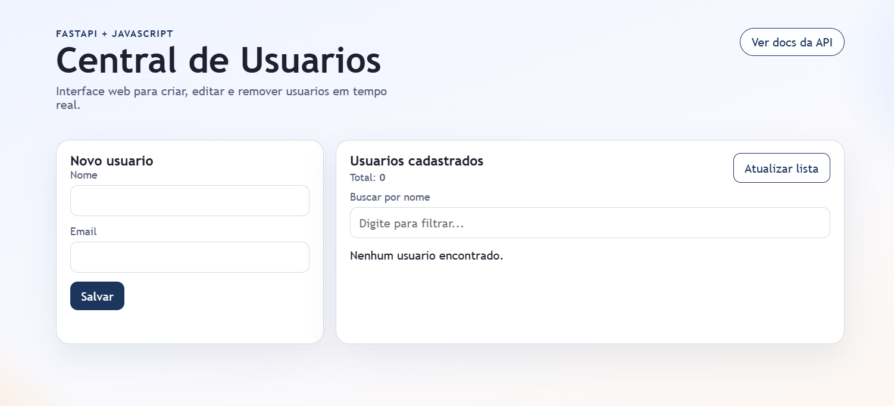

# Central de Usuarios

Aplicacao full stack de CRUD de usuarios desenvolvida para portfolio, com backend em FastAPI, frontend em HTML/CSS/JavaScript e persistencia em SQLite.

Links:
- App online: `https://central-usuarios.onrender.com/app/`
- Swagger: `https://central-usuarios.onrender.com/docs`
- Repositorio: `https://github.com/SherleyFelipe/central-usuarios`

## Preview

Tela inicial da aplicacao Central de Usuarios, com formulario de cadastro e listagem de usuarios.



## Visao Geral

O projeto permite:
- cadastrar usuarios
- listar usuarios
- buscar usuarios por nome no frontend
- editar usuarios
- remover usuarios
- consumir a API via interface web e Swagger

Foi construido para demonstrar integracao entre frontend e backend, organizacao de projeto, persistencia de dados, deploy e testes automatizados.

## Stack

- Python 3
- FastAPI
- Uvicorn
- SQLite
- HTML
- CSS
- JavaScript
- Render
- GitHub Actions

## Funcionalidades

- CRUD completo de usuarios
- validacao de dados com Pydantic
- persistencia local com SQLite
- frontend servido pela propria API
- redirecionamento da raiz `/` para `/app/`
- documentacao automatica em `/docs`
- token opcional por variavel de ambiente para proteger operacoes de escrita
- testes automatizados de integracao
- deploy online no Render

## Estrutura

- `app/main.py`: cria a aplicacao FastAPI e define as rotas
- `app/database.py`: inicializa o banco e centraliza a conexao SQLite
- `app/schemas.py`: modelos de entrada e saida
- `app/auth.py`: validacao opcional do token via `API_USUARIOS_TOKEN`
- `frontend/index.html`: estrutura da interface
- `frontend/style.css`: estilos da interface
- `frontend/app.js`: integracao do frontend com a API
- `tests/test_api.py`: testes automatizados de integracao
- `render.yaml`: configuracao de deploy no Render

## Endpoints

- `GET /health`: status da API
- `GET /usuarios`: lista usuarios
- `GET /usuarios/{id}`: busca usuario por ID
- `POST /usuarios`: cria usuario
- `PUT /usuarios/{id}`: atualiza usuario
- `DELETE /usuarios/{id}`: remove usuario

Se `API_USUARIOS_TOKEN` estiver configurada, `POST`, `PUT` e `DELETE` exigem o header:

```text
X-API-Token: SEU_TOKEN
```

## Como Rodar Localmente

Requisitos:
- Python 3.10+
- PowerShell no Windows

Entrar na pasta do projeto:

```powershell
cd "c:\Users\sherl\Documents\Portifolio\api-usuarios"
```

Criar e ativar o ambiente virtual:

```powershell
python -m venv venv
.\venv\Scripts\Activate.ps1
```

Instalar dependencias:

```powershell
.\venv\Scripts\python.exe -m pip install -r requirements.txt
```

Iniciar a API:

```powershell
.\start_api.bat
```

Ou, se preferir:

```powershell
.\venv\Scripts\python.exe -m uvicorn main:app --host 127.0.0.1 --port 8000
```

Abrir no navegador:
- Frontend: `http://127.0.0.1:8000/app/`
- Swagger: `http://127.0.0.1:8000/docs`
- Health: `http://127.0.0.1:8000/health`

## Variaveis de Ambiente

- `API_USUARIOS_DB_PATH`: caminho customizado do banco SQLite
- `API_USUARIOS_TOKEN`: se definida, protege operacoes de escrita

Exemplo:

```powershell
$env:API_USUARIOS_TOKEN="central-usuarios-admin-2026"
.\venv\Scripts\python.exe -m uvicorn main:app --host 127.0.0.1 --port 8000
```

Arquivo de exemplo:
- [.env.example](/c:/Users/sherl/Documents/Portifolio/api-usuarios/.env.example)

## Testes

Rodar os testes automatizados:

```powershell
.\venv\Scripts\python.exe -m unittest tests.test_api
```

Os testes:
- iniciam a API localmente em uma porta livre
- usam banco SQLite temporario
- validam fluxo de CRUD
- validam erros de duplicidade e autenticacao

Tambem existe pipeline no GitHub Actions em [.github/workflows/tests.yml](/c:/Users/sherl/Documents/Portifolio/api-usuarios/.github/workflows/tests.yml).

## Deploy

O projeto esta configurado para deploy no Render com [render.yaml](/c:/Users/sherl/Documents/Portifolio/api-usuarios/render.yaml).

Pontos importantes:
- a aplicacao usa `PORT` no ambiente de deploy
- SQLite online precisa de disco persistente para manter os dados apos restart
- se `API_USUARIOS_TOKEN` estiver definida no Render, clientes externos precisam enviar `X-API-Token`

## Diferenciais Para Portfolio

- projeto full stack funcional
- frontend e backend integrados no mesmo deploy
- documentacao automatica da API
- configuracao de deploy
- testes automatizados
- uso de variaveis de ambiente

## Proximos Passos

- migrar de SQLite para PostgreSQL em producao
- adicionar paginacao e busca no backend
- criar autenticacao admin com JWT
- melhorar feedback visual de sucesso e erro no frontend
- adicionar screenshot ou GIF do projeto no README
